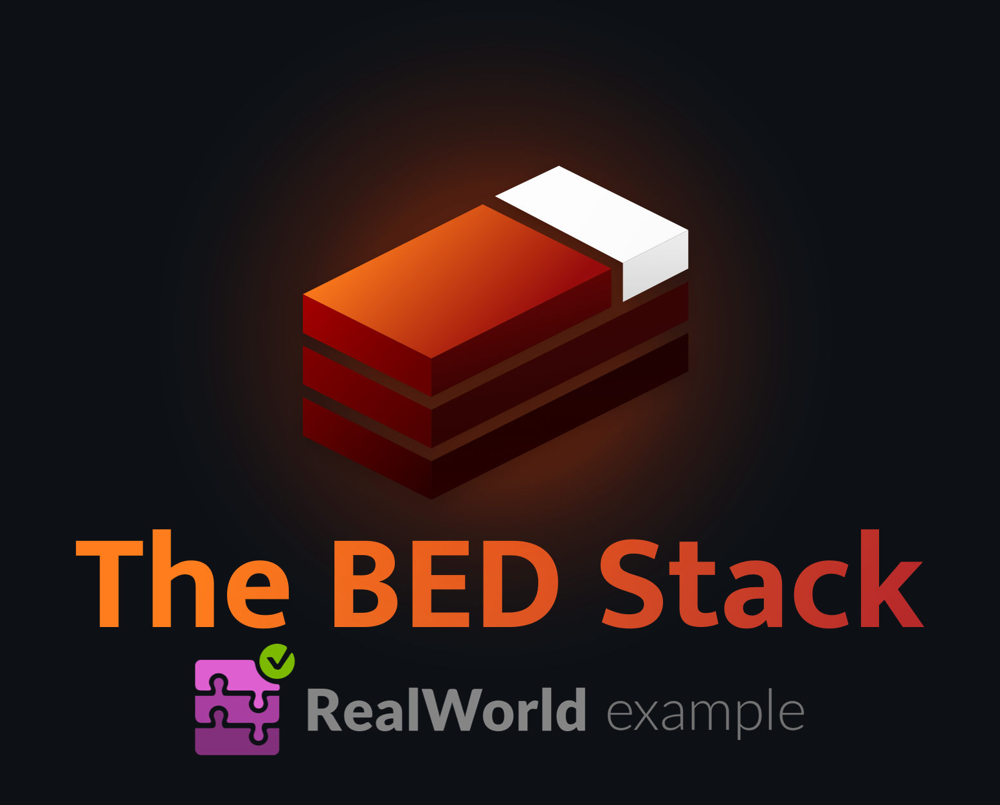

<div align='center'>

# ElysiaJS RealWorld 

###### _An exemplary app in the backend crafted with [Bun](https://bun.sh/) + [ElysiaJS](https://elysiajs.com/) + [DrizzleORM](https://orm.drizzle.team/) that adheres to the [RealWorld spec and API](https://realworld-docs.netlify.app/docs/specs/backend-specs/introduction/)._

[](https://github.com/agnyz/elysia-realworld-example-app/actions/workflows/test.yml) [](https://discord.gg/PH4rBdTU) [](https://agnyz.github.io/elysia-realworld-example-app) [](https://demo.realworld.io/) [](https://github.com/agnyz/elysia-realworld-example-app/blob/main/LICENSE)

</div>

---

[](https://github.com/gothinkster/realworld)

This codebase was created to demonstrate a fully fledged backend application built with **Bun, ElysiaJS, and DrizzleORM** including CRUD operations, authentication, routing, pagination, and more.

We've gone to great lengths to adhere to the **Bun, ElysiaJS, and DrizzleORM** community styleguides & best practices.

For more information on how to this works with other frontends/backends, head over to the [RealWorld](https://github.com/gothinkster/realworld) repo.

🚀 Give it a try and let us know if you have any questions or feedback on [Discord](https://discord.gg/PH4rBdTU) or [GitHub Discussions](https://github.com/agnyz/elysia-realworld-example-app/discussions).

## How it works

The application uses [ElysiaJS](https://elysiajs.com/) framework to implement the [backend API](https://realworld-docs.netlify.app/docs/specs/backend-specs/introduction) outlined in the [RealWorld docs](https://realworld-docs.netlify.app/).

It relies on [Postgres.js](https://github.com/porsager/postgres) to store data, and interacts with it through [DrizzleORM](https://orm.drizzle.team/docs/quick-postgresql/postgresjs).

The runtime is [Bun](https://bun.sh/) and the code is written in [TypeScript](https://www.typescriptlang.org/).

## Documentation

Check out our documentation by visiting https://agnyz.github.io/elysia-realworld-example-app.

## Getting started

> [!NOTE]
> This project includes support for [Dev Containers](https://code.visualstudio.com/docs/remote/containers) in VSCode. Read more about it in [Developing in a Dev Container in the docs](https://agnyz.github.io/elysia-realworld-example-app/dev-container.html).

1. **Clone and install dependencies**

    ```sh
    gh repo clone agnyz/elysia-realworld-example-app
    cd elysia-realworld-example-app
    bun i
    ```

2. **Ensure Docker daemon is running and spin up the Postgres+Bun container**

    ```sh
    bun up
    ```
3. **Migrate the schema to the database**

    ```sh
    bun db:migrate
    ```

4. **Run the app**

    ```sh
    bun dev
    ```

## Contributing

See [Contributing Guide](CONTRIBUTING.md).

## License

[MIT](LICENSE) License © 2023 Agnyz Technologies FC
